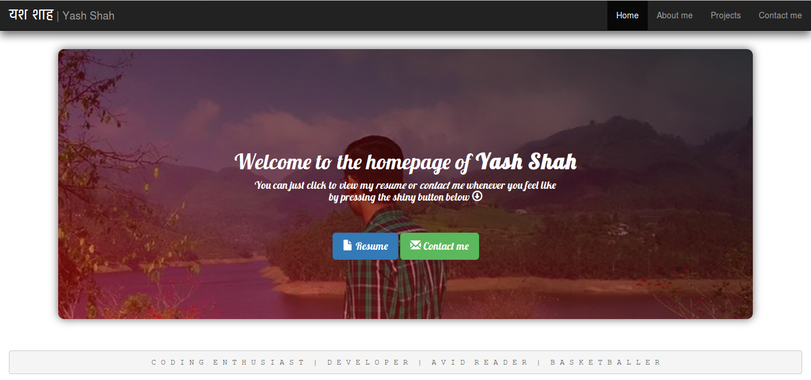

# My Homepage
## Everything you want to know about me

This webpage was developed as a part of **CS251** Assignment using *Bootstrap*, HTML and CSS.

It has several sections :
* **Home** : The homepage of the website, which also has a link to my *resume*
* **About me** : Has everthing you would like to know about me, including my hobies, achievements and some of my favourite pics with my friends.
* **Projects** : It houses some of my projects till date.
* **Contact me** : My contact details, including my phone number, address, email and social networking ids.
It also has a provision for you to provide feedback or ask queries regarding any topic :wink:
 
